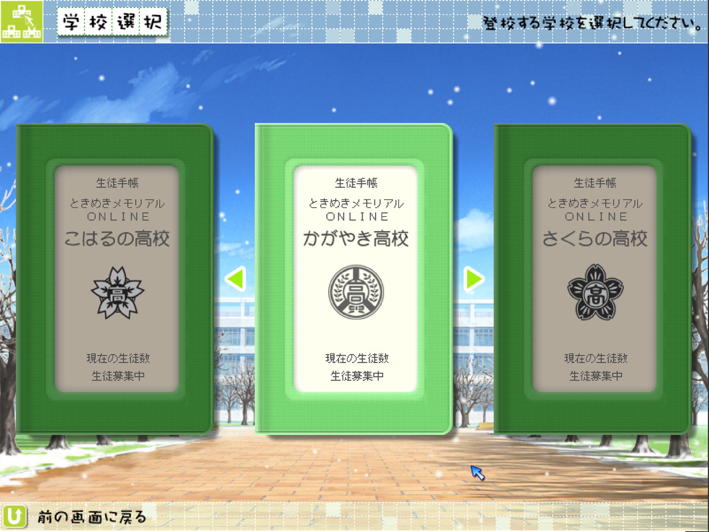
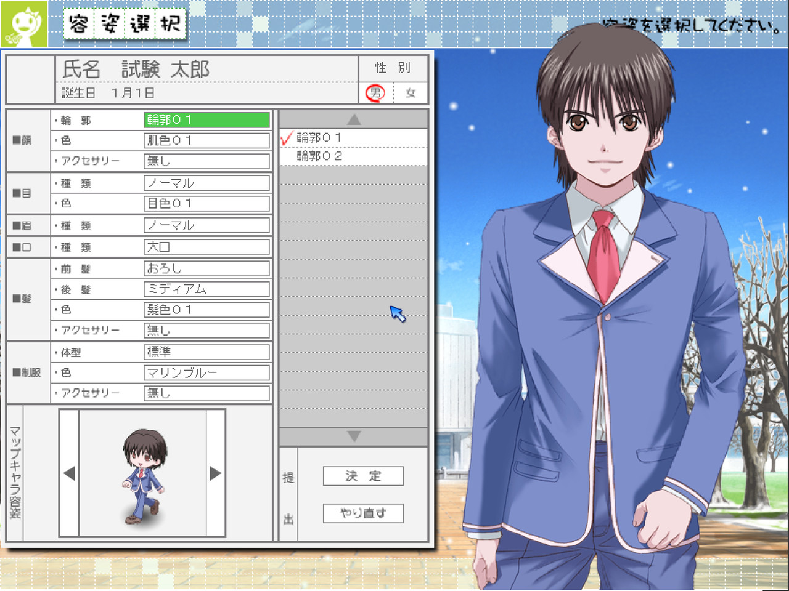
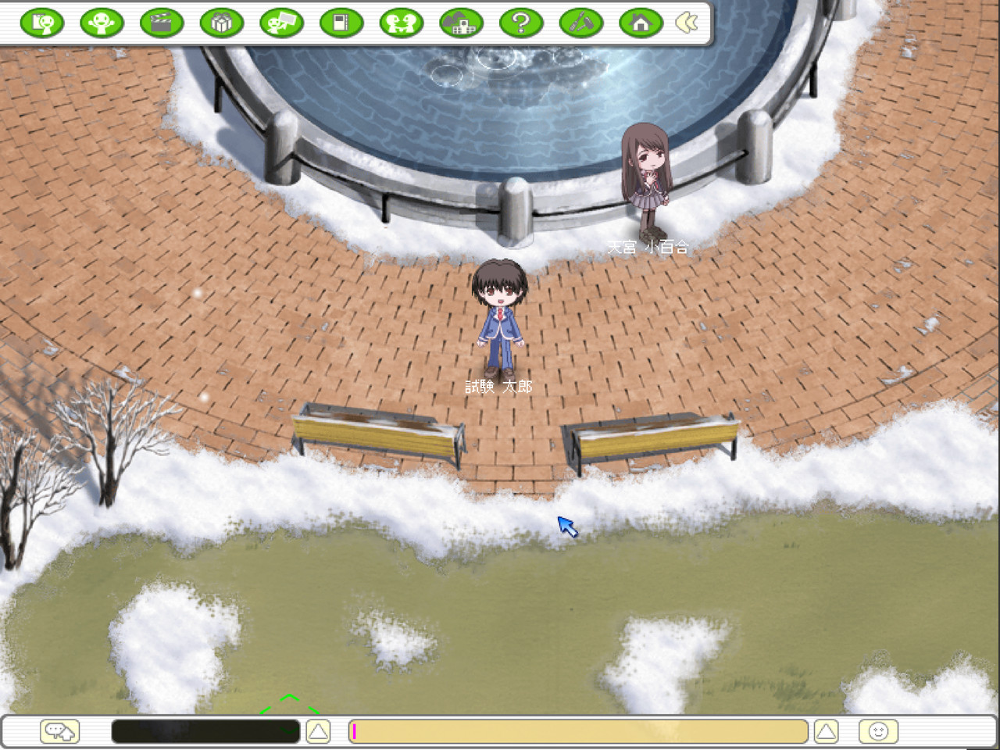
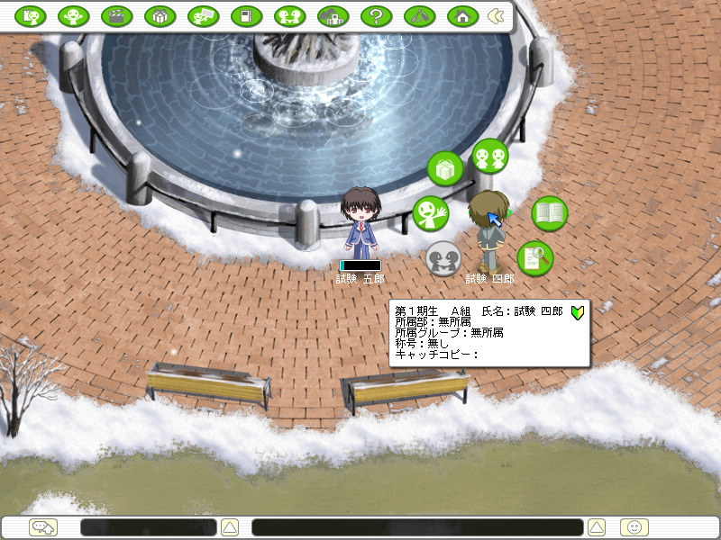
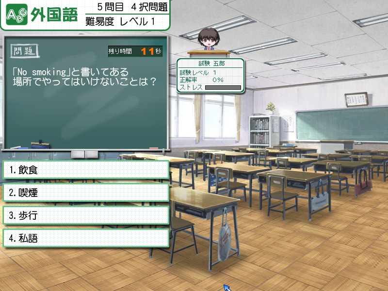
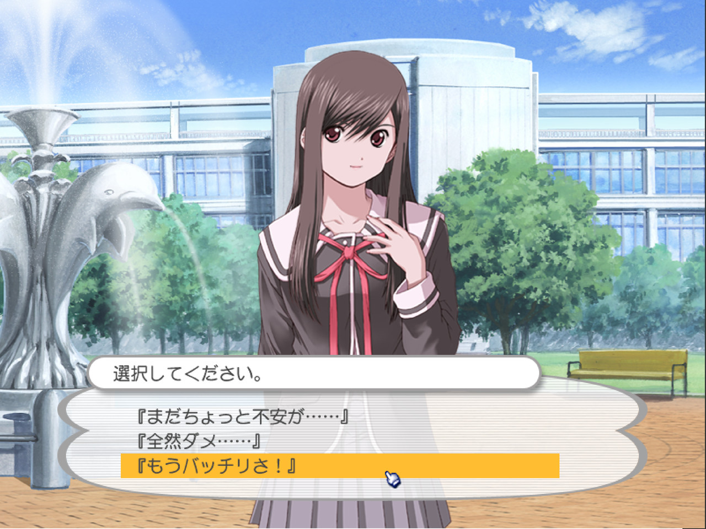
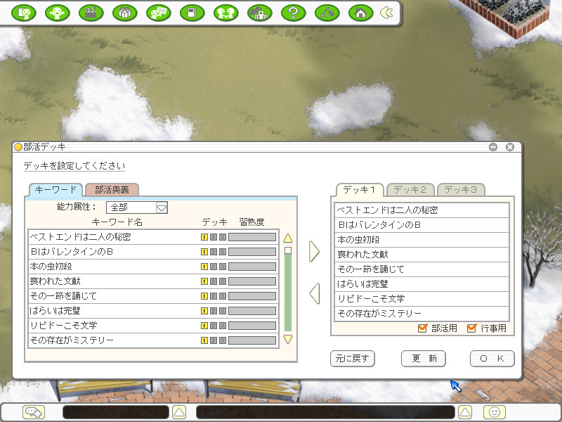
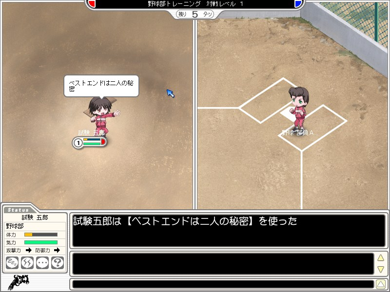

# Tokimeki Memorial ONLINE — local server

A from-scratch server for *Tokimeki Memorial ONLINE* (KONAMI, 2006–2007, service ended),
written so that a surviving copy of the original client has something to connect to again.

Run it on your own machine, point your own copy of the client at it, and you can log in,
create a character, go to school, sit through a lesson, and play a club match — against
the practice opponents, or against somebody on a second machine.

<!-- HTML rather than markdown for the width="50%": a markdown table would size its columns
     from the caption text instead. The shots are 800x600, which is what the client draws
     at; the four oldest were kept at the 1280x960 they were captured at. -->
<table>
<tr>
<td width="50%" valign="top">



</td>
<td width="50%" valign="top">



</td>
</tr>
<tr>
<td valign="top"><b>Choosing a school.</b> Ten of them, each with a student count this server reports as zero.</td>
<td valign="top"><b>Making a character.</b> The client's own creation sheet, kept verbatim by the server.</td>
</tr>
<tr>
<td valign="top">



</td>
<td valign="top">



</td>
</tr>
<tr>
<td valign="top"><b>Standing in the courtyard.</b> The player is put into the scene by the server, the NPC by one of the <code>/npc</code> commands.</td>
<td valign="top"><b>Somebody else on the same map.</b> Two clients, one server; right-clicking the other player opens the six slots, and the card underneath is filled in from their save.</td>
</tr>
<tr>
<td valign="top">



</td>
<td valign="top">



</td>
</tr>
<tr>
<td valign="top"><b>A lesson under way.</b> The message that opened it carried three numbers and no text: the client holds the questions, and this end picks which one and marks the answer.</td>
<td valign="top"><b>A scripted scene.</b> The client plays the cut-scene out of its own copy of the game; this end only answers the questions it stops on.</td>
</tr>
<tr>
<td valign="top">



</td>
<td valign="top">



</td>
</tr>
<tr>
<td valign="top"><b>The club deck.</b> The keywords a character owns, and the deck they are dealt into — both lists read back out of the save.</td>
<td valign="top"><b>A club match.</b> Eight turns, and this is the sixty seconds a side gets to choose a card; the order they resolve in is settled at this end.</td>
</tr>
</table>

## About

The servers went away; the client did not. The campus, the characters and the scripts are
all still on the disc, intact and unreachable. This is the half that vanished, rebuilt from
the outside by watching what the client asks for.

This is an independent implementation of the game's network protocol, produced by analysing
how the client communicates, for the purpose of interoperability: letting an existing client
program reach a server again.

It contains no code, artwork, audio or text taken from KONAMI's software. It does contain
tables of integers, read mechanically out of the client's data files, because there are
decisions this server is asked to make that it cannot make without them. Nine of them
are files under `reference/`; the smaller ones — a week's timetable, a set of key ranges, a
shop's bills — are written into the modules that read them. See
[Reference data](#reference-data) for both. Message names, map names and structure offsets
appear here because they are the identifiers the protocol itself uses; a client will not
accept any other wording for them.

*Tokimeki Memorial* is a trademark of KONAMI. This project is not affiliated with, endorsed
by, or connected to KONAMI in any way.

## What works

Every line below is something a client has been watched doing against this server. What
they do *not* add up to is the first bullet of the next section.

**Getting in.** The update check, the authentication step, the login-server lookup, and the
login, game and school servers behind it. Registration codes are issued here and bound to a
KONAMI ID; an account keeps its own characters and its own saves, and several accounts can
be on the server at once. Choosing a school, making a character, deleting one, going to
school, logging out from the options window, and coming back to the square you left.

**The campus.** Walking, the doorways and staircases between the 78 maps, and both your
position and your map kept across a logout. Two players standing on the same map see each
other and share the chat bar along the bottom, and either can right-click the other for the
six-slot interaction menu behind it: the address book (ask, accept, decline, remove), the
friendly group (found one, invite, accept, expel, leave, disband, hand the leadership on,
set its catchphrase and whether it is listed), a name card, the career card with an
achievement list under it, and a report card that opens only if the person it belongs to
ticked the box for it.

**School.** The timetable is the client's own, and the bells ring off it without being
asked — a warning bell, a start bell, and if you are sitting in your own classroom when the
second one goes, you are in the lesson. Ten questions, true-or-false and multiple choice,
the eight help skills, the separate chat bar a lesson has of its own, and a result screen at
the end. An exam period puts a twenty-question paper with a ten-minute clock through the
same doorway, and the marks land on the report card. Behind all of it: the six ability
parameters, stress and condition, and the injury that comes of training while carrying too
much of both.

**Clubs.** Joining one of the eight and leaving it, the club-deck window's three lists —
keywords, club skills with the level each has reached, and the three decks they go into —
and the item window's six tabs, where a thing can be worn, used, thrown away, or put in the
locker the whole account shares. A training room goes up on the noticeboard, other players
join it, and the match that follows runs its full eight turns: the cards each side plays,
the order they resolve in, the effects and reactions they draw, status ailments that outlast
the turn that caused them, a result screen, and a player who drops out halfway carried to
the end rather than stranding everybody else.

**Scripted events.** The client plays a cut-scene out of its own copy of the game and stops
at every branch to ask this end which way to go — which is where that decision always
belonged, since the client's own arithmetic instructions are logging stubs that compute
nothing. Most of those answers come off the branch table; one narrow family of them — the
switch that picks which backdrop a conversation opens on — comes from `server/gs3vm.py`,
which runs the script's arithmetic alongside the client and so holds the register file the
client never had, or, on a copy with no script exports to run, from `season_switch.json`.
Between them: right-click conversations with the candidates who have
appeared, the choice boxes inside them and the intimacy each answer is worth, the opening
tutorial, the letter in the classroom lockers, the drama events, and the ending with its
staff roll. Two of the scripts running here are the *original server's* own — the pair
behind the row of lockers that decides whether a letter is waiting — read out of the game's
data and run on this side, which is the side they always ran on.

## What this is not

- **Not a restored game.** [What works](#what-works) is a list of subsystems, and a list of
  subsystems is not a game. A good deal of it now happens through the client's own windows —
  the bells ring by themselves, a lesson runs from the seat to the result screen, a whole
  club match is played without touching the console — but the campus is still populated by
  hand, every scripted event is still started by hand, and whatever decided *when* a story
  happened has no counterpart here. The original server's own logic — how NPCs moved, what
  fired an event, what advanced the dating-sim progression — did not survive alongside the
  client, and none of it is reimplemented here. What you get is a school you can walk into
  and spend an afternoon in, not a game you can play through.
- **Not a service.** This repository is the software, and nothing here is or will be sold.
  It does not hand out a server to join: running one is something you do on your own
  machine, which is what the whole of *Connecting a client* is about.
- **Not a source of game files.** No client, no assets, no patched executable. You supply
  your own copy.

Not every number in this server is a fact. The wire format — message ids, structure layouts,
field offsets — was read off the protocol and is verifiable. Some values only exist because
the client needs *something* there: movement speed, spawn positions, the school list. Those
are inventions, and the comments say so where they appear.

## Requirements

- **Python 3**, standard library only — no `pip install`, no virtualenv. Run here on 3.11
  and 3.14. It must be built against real OpenSSL; see the macOS note below.
- **`openssl` on PATH.** Used once, on the first run, to generate the certificate the
  authentication endpoint needs into `runtime/certs/`.
- **Your own copy of the original client.** This repository distributes no part of it. The
  original disc has been publicly archived on the Internet Archive, as
  [tokimekimemorialonlinejapan](https://archive.org/details/tokimekimemorialonlinejapan);
  whether you may obtain and use a copy is a question of the law where you are, not one this
  project answers.

The server runs on Windows, macOS or Linux. The game is a Windows program and also works
under Wine. On a Windows machine that is not Japanese it wants one system setting before it
will install or accept a name; see [Japanese, and one Windows
setting](#japanese-and-one-windows-setting).

Run end to end here in two shapes: the game on Windows 11 talking to a server on the same
host, and the game under Wine on macOS talking to a server on a different machine
(Debian 12).

## Installation

```sh
git clone https://github.com/ShuAkirasora/tokimeki-memorial-online-revival.git
cd tokimeki-memorial-online-revival
```

Or **Code** → **Download ZIP** and unpack it anywhere. There is nothing to build: the folder
is the program, and every command below runs from inside it.

Python is the only per-platform part.

- **Windows** — the [python.org](https://www.python.org/downloads/) installer, with **Add
  python.exe to PATH** ticked; without it none of the commands below are found. **Every
  `python3` in this README is `py` here**, and that is the only difference. `openssl` is not
  part of Windows, but Git for Windows carries a complete copy and this server looks there
  directly, so with Git installed there is nothing to do; failing that, `winget install
  openssl`.
- **macOS** — `brew install python`, or the python.org installer. **Not the `python3` that
  ships with macOS**: it is built against LibreSSL and cannot start this server's TLS
  listeners. `python3 -c "import ssl; print(ssl.OPENSSL_VERSION)"` says which one is first in
  your PATH; `LibreSSL` in the answer means the wrong one is, and the cure is to call the one
  you installed by its full path, under `brew --prefix python`. `openssl` is already there.
- **Linux** — your distribution's own `python3` and `openssl`, as they come.

Three things about the first start, none of them fatal:

- **A firewall asks once** on Windows and macOS; answering no leaves a game on this machine
  working and every game elsewhere unable to arrive. With `ufw` or `firewalld` you open the
  [ports](#ports) yourself.
- **443, 80 and 50 are often already held**, and `[authhttp] skip :443 (...)` in the log says
  so rather than failing. On Linux they are privileged as well, so either start as root or
  `sudo sysctl -w net.ipv4.ip_unprivileged_port_start=50` (a file in `/etc/sysctl.d/` makes
  that survive a reboot). On Windows they need no privileges, so a skip there means something
  else — usually IIS or another HTTP.sys service — has the port.
- **Windows reserves blocks of ports at boot** when Hyper-V or WSL is installed, and a block
  covering 25573–25575 stops the server dead instead of being skipped. `netsh int ipv4 show
  excludedportrange protocol=tcp` lists them.

One thing is handled for you and is only worth knowing when it still goes wrong: the
authentication certificate has to be SHA-1, which RHEL, Fedora and their derivatives refuse
to produce under their system-wide crypto policy. The first run notices the refusal and
repeats that one command with the policy overridden, changing nothing about the machine. If
even that fails it stops and prints what openssl said.

## Running the server

```sh
python3 start_servers.py                          # game on this same machine
python3 start_servers.py --advertise-ip 192.168.1.5   # game on another machine
python3 stop_servers.py
```

It runs detached, so the terminal can be closed; `[system] all services started` in the log
means it came up. Stopping goes by which ports are held rather than by a recorded process id,
so a stale record does not strand a running server.

**`--advertise-ip` is needed whenever the game is not on the server's own machine.** Logging
in is a chain of hops, each answering with the address of the next; unset, those answers are
`127.0.0.1`, which sends every remote player back to their own computer. It cannot be worked
out from the socket — behind a router, the address a client must dial is not one this machine
can see on any interface of its own. `TMO_ADVERTISE_IP` in the environment does the same, and
the startup log says which is in use.

The flag also decides what the server listens on, so that is not a second thing to get right.
`--bind` overrides it; [Ports](#ports) has the detail, including the three rows that stay on
`127.0.0.1` either way.

## Japanese, and one Windows setting

**The game is a Japanese program from 2006** and predates Unicode being universal. It, its
installer, and everything you type into it go through a single Windows setting — the *language
for non-Unicode programs*: one machine-wide value deciding which code page such programs are
handed. This game wants Japanese, code page 932. Setting it makes everything in this section go
away:

> Settings → Time & language → Language & region → Administrative language settings →
> Change system locale → **Japanese (Japan)**, then restart.

Or, from an administrator PowerShell, the same thing in one line and without the menus:

```powershell
Set-WinSystemLocale ja-JP
```

Then restart Windows from its own Start menu — a reset that cuts the power instead can lose a
registry change that has not been flushed yet, and the setting quietly comes back as it was.

Windows names that setting in whatever language it is displaying, so the words above are the
English ones: on a Japanese Windows the same line reads **Unicode 対応ではないプログラムの言語**,
which is worth knowing because installing this game is a good reason to have made Windows
Japanese already — and doing so does not set it.

**Making Windows Japanese is not the same thing.** The display language, the regional format,
the country under *Region*, and the keyboard you type with are four other settings, and none of
them moves this one. A machine that is Japanese in every visible way can still be running an
English or Chinese code page underneath — installer garbled, and Japanese typed into the game
arriving blank. One command says which one you have:

```
reg query "HKLM\SYSTEM\CurrentControlSet\Control\Nls\CodePage" /v ACP
```

`932` is the answer this game needs, and the only one known to work end to end. `1252`, `936` or
anything else is the cause of both problems below. `65001` means **Beta: Use Unicode UTF-8 for
worldwide language support** is ticked — it sits on the same dialog as the setting above, it
points the other way, and it leaves this game worse off rather than better; untick it.

That is a stock Windows setting, present in every edition and language, and it behaves the same
on Arm. It is the route this project's own testing has taken throughout.

### What it looks like when it is wrong

**The installer's text is garbled, and so is every window the client puts up.** Those are
ordinary Windows dialogs printing bytes read back in the wrong code page. The game's own screens
are drawn by the game and hold out longer, which is misleading: the error boxes, the ones you
most need to read, are not the game's.

**Japanese typed into a character's name arrives blank.** This one deserves spelling out,
because nothing on screen points at a locale — the keystrokes land, the field takes them, and
the characters are simply not there. `tmo.exe` asks the IME for what you typed through the ANSI
half of the old `IMM32` interface, so what comes back is code-page bytes and not Unicode; and
the game carries its own bitmap fonts, covering the Japanese set and nothing else, asking
Windows for no font at all. Under the wrong code page those two ends disagree and the glyph
looked up does not exist. Installing Japanese fonts changes nothing, because no Windows font is
in the path.

### The IME itself

Konami supported exactly one, and said so: the system requirements name *Windows 標準 (MS-IME)*
and guarantee nothing else. Windows 11 still ships it, rewritten, and it works — a Japanese name
typed into the creation sheet with the stock Windows 11 Japanese IME goes in, with nothing done
beyond the code page above. So when names will not go in, that is what to fix; it is not the
IME.

If you have some other reason to suspect it, Windows keeps a compatibility switch for programs
of this age that drive `IMM32` themselves, which this one does:

> Settings → Time & language → Language & region → **日本語** → Language options → Keyboard →
> **Microsoft IME** → Options → General → **Use previous version of Microsoft IME**

### Changing one program instead of the machine

If you would rather not change the whole machine, a per-application locale tool will put one
program into a Japanese locale and leave the rest of Windows alone.
[Locale_Remulator](https://github.com/InWILL/Locale_Remulator) does that, and works on Windows 11
on Arm for both 32- and 64-bit programs; the older and better known Locale Emulator does not work
on Arm at all — it starts the program, changes nothing, and reports no error while doing it.

**It does not reach the installer.** The disc carries an InstallShield package whose wizard is
drawn by a separate process that the tool never launches, so the wizard's text stays garbled
whatever you start it with. That is only text — the buttons stay readable, and every file and
folder inside the package has a plain ASCII name bar one shortcut to a web page, so what lands on
disk does not depend on any of this.

## Installing the game

The disc installs the game. This repository carries no part of it and installs nothing; what
follows is only the places where a machine that is not Japanese has to be told something, and
none of it is specific to this server.

The [archived copy](https://archive.org/details/tokimekimemorialonlinejapan) comes down as a
`.7z` holding the disc image. Unpack it with [7-Zip](https://www.7-zip.org/), then open the
`.iso` — Windows mounts one on a double-click and gives it a drive letter — and run the
installer on that drive.

**Give the installer an ASCII destination** — `C:\TMO` will do. The path it offers by default is
Japanese text, which on a machine that is not Japanese becomes a folder with a garbled name; an
ASCII path removes the question instead of answering it.

**If you installed before fixing the code page, install again.** A folder whose name was made
out of the old code page is spelled in characters the new one may not have, and the game reaches
its own files through the same ANSI calls as everything else; an install that worked yesterday
can stop finding itself. Uninstall, set the locale, and let it land in `C:\TMO`.

Once the game is installed, `Play.cmd` below is what starts it.

## Connecting a client

Three destinations inside the client have to end up here: two hostnames, which your `hosts`
file redirects, and one fixed numeric address, which is four bytes inside `tmo.exe`.

**None of it has to be done by hand.** On Windows, double-click **`Play.cmd`**. It asks for
the administrator rights the game already needed, asks once where the server is and remembers
the answer, writes the two hosts lines, patches the four bytes, checks that the server is
answering before it starts anything, and then starts the game. After the first time it is the
double-click and nothing else. Everywhere else the same thing is `python3 play.py`.

This folder has to be on the **machine the game is on**, which on a two-computer setup is not
the one running the server. Copying the whole folder there is fine, and so is copying only
`play.py`, `Play.cmd` and `set_auth_address.py`.

```sh
python3 play.py --server 192.168.1.5   # say it outright instead of being asked
python3 play.py --dry-run              # what it would change, writing nothing
python3 play.py --revert               # put the hosts file and the four bytes back
python3 play.py --no-launch            # set everything up, start nothing
```

Nothing it does is one-way. The hosts file is copied before it is first written and a line
of yours that points one of these two names elsewhere is commented out rather than deleted,
with the whole original line kept after the marker; `--revert` puts it back and takes the
four bytes back to what the disc shipped. It also knocks on the server's ports before
starting the game, so a server that is not running says so instead of becoming a client that
sits there.

On Windows it needs administrator rights and says so — the game already required them, and
the hosts file needs the same, so `Play.cmd` asks once and does both inside it. On macOS and
Linux only the hosts file does, and only that one step goes through `sudo`; the game is not
started as root. There, `--launch-with` names the command that runs Windows programs
(`wine` by default).

### The same three steps by hand

```sh
# 1. two lines in the hosts file of the machine the *game* runs on:
#      <server>  tmollb.tokimekionline.com
#      <server>  tmoupd.tokimekionline.com
# 2. python3 set_auth_address.py /path/to/tmo.exe <server>
# 3. run BootFirst.exe (as administrator on Windows)
```

The rest of this section is those three steps in full, and why each of them is there. None of
it is needed when `Play.cmd` worked.

### 1. Your server address

`<server>` above is the address the *game* has to dial, and which one it is depends on where
the game runs:

| Your setup | `<server>` |
|---|---|
| **One computer** — server and game on the same machine, including the game under Wine, since Wine uses that machine's own network | `127.0.0.1` |
| **Two computers** — the game on one machine, the server on another | the server machine's local address, usually starting `192.168.` or `10.` |

To find it, ask the **machine that will run the server**: `ipconfig` on Windows and read the
`IPv4 Address` line; `ipconfig getifaddr en0` on macOS (try `en1` if that is empty);
`hostname -I` on Linux, first address. The examples below use `192.168.1.5`.

### 2. The two hostnames

The game looks for its update and login-server lookup by name, and nothing inside the client
decides where those lead — your computer's `hosts` file does:

```
192.168.1.5  tmollb.tokimekionline.com
192.168.1.5  tmoupd.tokimekionline.com
```

⚠️ **The file to edit is on the machine the *game* runs on, not the machine the server runs
on.** If the game runs under Wine, Wine has no name resolution of its own, so the file is the
Mac's or Linux box's `/etc/hosts` — not anything inside the Wine folder.

- **Windows:** Start → type `notepad` → right-click **Notepad** → **Run as administrator**
  (opening the file any other way will not be allowed to save it). **File → Open**, paste
  `C:\Windows\System32\drivers\etc\hosts` into the filename box, Enter — set the file-type
  dropdown to **All Files** if the folder looks empty. Add the two lines at the end and save.
- **macOS and Linux:** `sudo nano /etc/hosts`, add the two lines at the end, `Ctrl-O` and
  `Enter` to save, `Ctrl-X` to leave.

Nothing inside the game's own folder has to be edited for this. The update check is also
configurable, as `SERVER_ADDRESS` in the client's `update.ini`, but that file ships with the
hostname in it — so the hosts entry covers it too.

### 3. The address inside tmo.exe

The client's third destination is not a name at all: it opens a connection straight to a
fixed numeric address that was KONAMI's, and no amount of name resolution can redirect an
address that is never looked up. That one is told to the client directly:

```sh
python3 set_auth_address.py /path/to/tmo.exe 192.168.1.5
```

Run it on whichever machine holds `tmo.exe` — on a two-computer setup, install Python there
as well, or copy the file over, run the command, and copy it back. On Windows that looks like
`py set_auth_address.py "C:\Games\TokimekiOnline\tmo.exe" 192.168.1.5`; under Wine the file
sits inside the bottle or prefix and your Mac or Linux `python3` reaches it directly.

It prints what it is about to do, keeps a copy of the original as `tmo.exe.orig` before
writing anything, and then reports where the two hostnames currently lead:

```
  the two names the client resolves for itself:
    tmollb.tokimekionline.com  -> 192.168.1.5      ok
    tmoupd.tokimekionline.com  -> 192.168.1.5      ok
```

**Two `ok` lines means step 2 is done as well.** Anything else and it prints the lines you
are missing. If it still shows an old answer after you edited the file, the lookup is cached:
`ipconfig /flushdns` on Windows, `sudo dscacheutil -flushcache; sudo killall -HUP
mDNSResponder` on macOS, `sudo resolvectl flush-caches` on Linux.

Other arguments: no address at all reports what your copy currently points at without
changing anything, `--revert` puts KONAMI's original address back, `-n` says what it would do
and writes nothing, `--no-lookup` skips the hostname check.

### 4. A registration code and a KONAMI ID

The login screen asks for three things, and this server means all three:

| The box on the login screen | What goes in it |
|---|---|
| KONAMI ID | an account name — up to 64 of `A-Z a-z 0-9 . _ -`, and not case-sensitive |
| パーソナルキー | its password — 4 to 64 of `A-Z a-z 0-9`, and case-sensitive |
| レジストレーションコード | twenty characters in five groups of four, which this server has to have issued |

Those two alphabets are the client's rather than this server's: the login screen accepts
nothing else, so a value outside them is one that cannot be typed into the box it belongs in.

**A code that was made up rather than issued will not do.** The client refuses it in its own
words, 「入力されたレジストレーションコードは存在しません」 — the right answer, and an opaque
one if you were not expecting it. All three values come from one page.

#### The page that hands them out

Open **http://127.0.0.1:12013/** in a browser on the machine running the *server*, or
`http://<server>:12013/` from anywhere that can reach it. One form: a KONAMI ID, a personal
key typed twice, **Create**. What comes back is the code, already bound to that id and laid
out in the same five groups as the login screen. Type all three into the client and you are
in.

⚠️ **Write the code down. Nothing mails it to you** — there is no email step here at all —
and the page holding it stops working fifteen minutes after it is drawn. Losing it costs
nothing: the same form, with the same id and the same key, gives the same code back instead
of issuing a second one. A reload does the same, so a form sent twice is not a second code
and not an error.

A form that will not go through says which box was wrong, in plain English. The one refusal
that also arrives in the client's own words is 「ユーザ情報が正しくありません」: on this form it
means the id is already somebody's and this is not their key, so pick another id.

#### A code somebody gave you

Originally a code came printed in the box and the player bound it to their KONAMI ID on
KONAMI's website. Both halves are still here, apart, at **http://127.0.0.1:12013/register** —
one form makes a KONAMI ID, the other binds a code to one. That page is the way in for a code
an operator issued by hand, and it is what answers the client's other refusal,
「レジストレーションコードが登録されていません」: a real code that no id has claimed yet.

```sh
python3 issue_code.py --unregistered   # WJUH-RTDC-M39X-HCDN-U26X, for /register to bind
python3 issue_code.py                  # the same, but usable as it stands
python3 issue_code.py --list           # every code, its state, and who registered it
python3 issue_code.py --revoke CODE    # withdraw one, leaving the characters saved under it
```

⚠️ **The second line makes a code with no owner, and a code with no owner is one anybody can
log in with.** It is for handing to somebody at the same machine. `--count`, `--note` and
`--expires` are on the issuing side and `--restore` undoes a revoke; `--help` has the rest.

Nothing about an account differs between the two pages. `/` runs both steps in one request
because there is no printed box here to wait for.

#### It is not an encrypted page

Plain HTTP unless you give it something better. It cannot borrow the certificate the game
insists on — 1024-bit RSA signed with SHA-1, which no current browser will open — so by
default the personal key crosses in the clear: nothing when the browser is on the server's
own machine, a password in plaintext when it is not. **Pick a key you do not use anywhere
else.** A server that people reach over the internet, under a name of its own, can put an
ordinary modern certificate in front of that one page:

```sh
python3 start_servers.py --registration-cert fullchain.pem --registration-key privkey.pem
```

It is a separate certificate from the one the game speaks to and changes nothing about the
game's own connection. Given it, the page serves over TLS and stops warning about clear text.

#### The limits

Two kinds sit on that page, and only one of them ever says so. An address that has sent a lot
of forms in the last hour, or been given a lot of codes today, gets its answers a few seconds
late and otherwise unchanged — an address can be a whole building, so nothing here refuses on
the strength of one, and a browser on the server's own machine is exempt entirely. The
exception is fifty codes handed out by the form in a day, which closes it until tomorrow and
says that it has; `/register` and `issue_code.py` count towards nothing and are stopped by
nothing, so a code issued by hand still works on the day it happens. Login answers slow down
the same way after five wrong personal keys in a row for one account, and a right key is
never held back for a moment. Through a held login the client shows the same
「接続処理を行っています」 it shows through an ordinary one, so a slowed answer reads as a slow
network rather than as anything having gone wrong. `server/throttle.py` has the numbers, and
explains why none of this is a security boundary.

### 5. Start the game

**The program to run is `BootFirst.exe`, not `tmo.exe`.** It starts `UpdateClient.exe`, which
performs the update check, and that in turn starts the game.

On Windows, run `BootFirst.exe` **as administrator** — right-click → *Run as administrator*.
Without that you get `アップデートクライアントの起動に失敗しました` and nothing at all
reaches this server, because nothing was ever started. The cause is on the client's side and
no server can answer it: `UpdateClient.exe` is a 32-bit binary with no manifest and "Update"
in its name, which is exactly what Windows' installer detection looks for, so the system
decides it requires elevation — and `BootFirst.exe` starts it with `CreateProcess`, which
cannot elevate. Beginning the chain already elevated is the whole of the fix. Under Wine this
has not come up: the same chain starts as it is.

### 6. Check that it worked

Everything the client does arrives in `runtime/run_all.log` in order — `tail -f
runtime/run_all.log`, or `Get-Content runtime\run_all.log -Wait -Tail 20` in PowerShell. Each
line below is one of the steps above proving itself, and the first one **missing** tells you
where to go back to:

| A line like this | Means |
|---|---|
| `[system] all services started` | the server is up |
| `[updater] … sent UPDATE_DONE` | `tmoupd` resolves — step 2 |
| `[llb35573] -> MsgSvResultLoginServer` | `tmollb` resolves — step 2 |
| `[authhttp] ACCEPT port=443` | the four bytes are right — step 3 |
| `[mpslogin25573] … login: code …` | the code and the KONAMI ID were accepted |
| `[mpsgame25574] …`, `[mpsschool25575] …` | the game and school servers; you are in |

After that you are at the school-select screen. Steps 2, 3 and 4 are done once and stay done —
unless you reinstall the game, which puts the original `tmo.exe` back, or the server machine's
address changes.

## What changes in your copy of the client

**One thing changes: where it looks for a server. Nothing about how it behaves does.** Its
connections are Blowfish-enciphered, and this server implements that layer and speaks it as
the protocol's other endpoint. No check is bypassed, no encryption is switched off, and every
piece of code that ships in the binary is the code that runs.

| | How the client finds it | How it is redirected |
|---|---|---|
| `tmoupd.tokimekionline.com` | hostname — the update check | name resolution |
| `tmollb.tokimekionline.com` | hostname — the login-server lookup | name resolution |
| `133.221.34.229` | a fixed numeric address, straight to `connect()` | the four bytes |

Everything after those three follows along on its own: the login, game and school servers are
reached at whatever address the login-server lookup hands back. The third one takes a
different route because it has to — the hostname `sctrl01.game.konaminet.jp` travels along
with that connection, but only as request metadata in the `Host:` header, and takes no part
in deciding where to connect.

**What the four bytes are, exactly.** The client builds the address one octet at a time,
straight onto the stack, and hands the result to `connect()`:

```
mov byte [esp+0x28], 133
mov byte [esp+0x29], 221
mov byte [esp+0x2a], 34
mov byte [esp+0x2b], 229
```

Those four immediates are the whole of the target, and they are all the script writes to. It
changes no instruction, removes no check, disables nothing, and every octet is an independent
byte so any address fits. Reverting restores the original four, which — since nothing else
was ever touched — leaves the file byte-for-byte as it was. It also refuses to work blind:
rather than trusting a hardcoded offset it scans for that instruction shape and requires it
to occur exactly once, copies the original to `tmo.exe.orig` before the first write, and
never overwrites an existing backup.

Two things that looked like obstacles turned out not to be: the client carries a small trust
store but does not enforce it, so a locally generated self-signed certificate is accepted;
and no part of the client has to be disabled to get through authentication, including its
encryption, which stays on from the first packet to the last.

## Ports

| Port | Service | Reached by |
|---|---|---|
| 12000 | update check the client performs at startup | the game |
| 35573 | login-server lookup — answers "which host do I log in to" | the game |
| 25573 | login | the game |
| 25574 | game | the game |
| 25575 | school | the game |
| 443 | account auth, TLS | the game |
| 12013 | the registration page | a browser |
| 50, 8011, 12011 | the same auth service on other ports, TLS | nothing, ever |
| 80, 12012 | the same auth service, plaintext | nothing, ever |

**The last two rows have never had a connection**, across every log this project has kept,
and the client's authentication URL has no port in it, so it uses 443 and only 443. They stay
bound to `127.0.0.1` whatever `--bind` says: they exist for this project's own tests, and
there is no configuration under which somebody else should reach them.

The rest follow `--bind`, which is derived from `--advertise-ip` rather than being a second
thing to remember. Advertising `127.0.0.1` tells every client to dial its own machine, so a
socket open to the network under that setting serves nobody — the default therefore listens
on `127.0.0.1` alone, and giving `--advertise-ip` opens the six above along with it. Then
25573, 25574, 25575, 35573, 12000 and 443 have to be reachable from the game's machine, so
open those on any firewall in between.

Ports below 1024 need privileges on Linux, and none on Windows. **macOS is stranger than
either**: an ordinary user may bind `0.0.0.0:443` but *not* `127.0.0.1:443` — the wildcard is
the permitted one, which is the opposite of the intuition that a narrower bind asks for less.
So on macOS the default configuration opens 443 wide because it has no choice, and closes any
connection that is not from this machine without reading it; the log says so at startup. A
port that cannot be bound at all is not fatal — `[authhttp] skip :443 (...)` and the server
carries on.

## Commands

Typed into the game's own chat bar and handled by this server. They are a console for driving
the protocol rather than gameplay: most of them exist because sending a message by hand was
the only way to find out what the client would do with it. `/cmds` prints the whole list
inside the game, which is the copy that cannot go stale; the tables below are the same list,
grouped.

**Where you are.**

| Command | Effect |
|---|---|
| `/go <map name or id> [x y]` | move to a map |
| `/pos` | print where you are |
| `/maps <name>` | search the map table |
| `/dirs` | drop a marker for each of the sixteen direction values |
| `/act [<first>]` | the same ruler for the `action` field, sixteen values at a time |

**What a character has.** Each of these reads a sheet the client draws somewhere and writes
it back to the save.

| Command | Effect |
|---|---|
| `/rom [name] [debut\|talk\|ev\|p <n>]` | read and move the romance state |
| `/couple [<charaId>\|clear]` | the couple flag, and who the partner is |
| `/card [ruler\|clear\|<subject> …]` | the report card |
| `/ab [ruler\|clear\|p <six values>\|<ability> <n>]` | ability parameters, stress, condition, days |
| `/opt [<row> on\|off\|clear]` | the four options rows, per character |
| `/career [title\|visits\|hours\|add\|del\|probe …]` | the career card and the achievements under it |
| `/post [class <key>\|club <n>\|clear]` | the two posts printed on the name card |
| `/buka [<1-8>\|part\|clear]` | join a club, or leave one |
| `/kw [n <count>\|add\|del\|deck <0-2> …]` | keywords owned, and what sits in each deck |
| `/cs [n <count>\|add\|del\|deck <0-2> …]` | club skills owned, and how complete each one is |
| `/item [sample\|n <count>\|add\|del\|probe]` | the inventory, by tab |
| `/locker [n <count>\|add\|del\|clear]` | the locker the whole account shares |
| `/group [create\|join\|leave\|disband\|hand\|qual]` | the friendly-group store |

**School.**

| Command | Effect |
|---|---|
| `/jikan [day]` | the timetable |
| `/bell [<subject>\|ready\|force\|ng <n>\|imp <n>]` | ring the warning and start bells by hand |
| `/lopt [seats\|speech\|words\|lunch] <n>` | knobs on the lesson message |
| `/quiz [sec <n>\|wait <n>\|ab …]` | the question in progress and which choice is right; timers |
| `/skill [<refusal> <reason>\|clear]` | what a refused help skill puts on screen |
| `/exam [on\|off\|ready\|force\|ans\|sec <n>]` | the exam period, its bell, the answers, the clock |

**NPCs, scripts and events.**

| Command | Effect |
|---|---|
| `/npc <cat>:<id> [<cat>:<id>]` | put an NPC on the map; a second key names a script |
| `/npca [<first> <last> [category]]` | place every romance candidate who has appeared |
| `/npcx` | stop replacing them |
| `/nev [<cat>:<id>]` | set the conversation-event key |
| `/smenu [<key>]` | which sub-menu a map object opens |
| `/evend [auto\|manual]` | how the end of an NPC event is answered |
| `/sc <name or id> [ctrl] [actor:npcId]` | start a script |
| `/sc next <name\|off>` | swap the script the next conversation asks for |
| `/scn`, `/sce`, `/scl` | step it on, end it, list what has been exported |
| `/scb [<scriptId> <ip> <target>\|clear]` | force a branch to go somewhere |
| `/sel [<select> [timer]]` | ask a choice box again |
| `/pwt [on\|off]` | whether the wait-for-players instruction is released |
| `/de [<genre>:<index>]` | the drama-event list |
| `/dms` | open the matching screen |
| `/raw <msgid16> [hex]` | send one message by hand, by number |

**Probes.** These are for reading the client rather than for playing: `/cb` drives a club
battle a piece at a time, and `/seq` replies with a sequence number that goes backwards, to
find out what the client makes of it.

The client intercepts a number of words itself — `/help` and `/where` among them — and never
puts them on the wire, so those names are unavailable no matter what the server does.

## Reference data

`reference/` holds ten tables, and each is something this server has to know in
order to decide something. All but one are integers and table keys.

**`mapgraph.json`** — grid size, collision and doorways for the 78 maps. Without it the map
graph is empty, the log says `warps go unchecked`, and moving between maps stops working.

All of them come out of the client's own data files. `mapgraph.json` is the one the wire can
confirm — the client decides where a door leads and this end only agrees, so the graph is a
check on that agreement rather than the source of it. The rest are here because
watching the protocol cannot recover what they hold at all:

**`branches.json`** — where a cut-scene goes when the player picks option k, for the 209
scripts that ask. Branch targets sit in an instruction's operands, and operands never travel
on the wire. Without it every branch falls through: scenes still play, choices stop mattering.
It holds 5125 of the game's 15586 branches, and the other two thirds are left out on purpose:
their conditions are script variables this end will always answer no to, and a no needs no
target. It carries no text, no option wording, no cast and no instruction stream.

**`season_switch.json`** — 2.5 KiB: the other kind of branch a table can answer. Five
scenarios open a scene by testing one register against 0, 1, 2 and 3 and picking a backdrop
for spring, summer, autumn or winter, and the season those four arms ask about is decided
here, not in the script. The table says which arm is which season and where it goes; this end
supplies the season. It matters more than a backdrop: the switch has a default arm for a
register holding none of the four, and what that arm plays is debug output the developers
left in the shipped data. Answer no to all four — which is what a server with nothing to say
does — and the player is shown it. It carries no text and no instruction stream, only which
branch a decision this end already makes is the answer to.

**`intimacy.json`** — under 9 KiB: what one conversation with a romance candidate is worth.
The game has 327 of them and this end has to keep the score, because intimacy never crosses
the wire: the client asks for a conversation by number, plays it, and says only that it
finished. It holds two tables keyed the same way. `gains` is the values a conversation can
add — most add a flat 12, 22 of them add nothing at all, and the ones that offer the player
an answer add 10, 12 or 15 depending on which. `byChoice` is which answer adds which, for
the 96 conversations where that is a question worth asking; the client reports the line the
player clicked, numbered the way the script numbers it, so this end can credit the right one.
One of the 327 names a script the client archive does not contain and is left out rather than
guessed at, because absent and worthless are not the same thing. Without the file every
conversation is credited 12, including the ones worth nothing. It carries no dialogue, no
answer wording and no character names.

A conversation that asks a question this end has no row for is credited the smallest of its
values instead — a floor rather than a reading. That happens when the answer never arrives,
and for the five conversations that ask something and pay nothing whichever line is taken.

**`quizkeys.json`** — about 6 KiB: how many questions each of the 80 lesson categories holds,
and the answers to the true-or-false half of the bank. A lesson message carries three numbers
and no text, and it is this end that picks the question and marks the answer, so a key is the
whole of what it needs; the four-choice half needs nothing at all, because this server
shuffles those itself and already knows where it dealt the right one. Without the file a
lesson draws the room and then asks nothing. It carries no question text, no choice wording
and no subject names.

**`npc_events.json`** — 44 KiB: which event key belongs to which NPC, and which script id it
starts. The client asks for an event by number and this end has to know whose it is; the keys
and the ids are both the game's own numbering. It carries the `.ssb` file names, which are
identifiers rather than content, and no dialogue, no cast and no event titles.

**`reserved_names.json`** — 15 KiB of SHA-256, and nothing else. Two of the game's tables
list names a new character may not be given, and this end is the one that refuses them, so
what it needs is the ability to answer "is this exact name on the list". A digest answers
exactly that question and no other, so the file holds no names at all.

**`clubbattle.json`** — 166 KiB, and the largest of these: the rule values a club match is
fought by. What a keyword hits and blocks for, how much of it a card has to learn before it
is fully in hand, which of the six abilities it raises and which materials it can yield; the
144 practice opponents' club, level, vitality, energy, speed and deck; which of them stand at
each rung of each club's ladder; every club skill's attack power, cost, success rate, its
three ±% modifiers, its two heals and the ailment it inflicts; and every skill book's recipe.
None of it crosses the wire — the client sends a card and is told what happened — so a match
cannot be fought without it. Integers and table keys throughout: it holds no name, not even
the opponents', because nothing in `server/` reads them. Without it 練習 is unavailable and
the log says so at startup; 自主トレ, which needs only the keyword rows, still runs.

**`drama_events.json`** — 5 KiB: the 22 `(genre, index)` keys a drama event can be asked for
by, the `.ssb` each one names, and the cast slots each has. Per slot: the sex it is for and
the keyword it requires, which together are the whole of `flgSelectActor` — the byte without
which every 登場人物 button on the party screen reads 「入れません」. The keys are the client's
own numbering and it looks the `.ssb` up in its own copy; this end only has to name one. It
carries the file stems, which are identifiers rather than content, and no title, no synopsis
and no cast names.

**`ngwords.json`** — 25 KiB, and the one table here that is words rather than numbers: the
game's own 禁止用語 dictionary, 1355 banned and 85 exemptions. Two places in the game refuse
text for containing a banned word — a scenario's free-text box and a group's name — and the
sentences for both are in the client while the dictionary is not: nothing in the client ever
loads this file, so the filter is the server's to run or not to exist. The exemptions have to
come with it, because the rule is a substring search and several innocent words contain a
banned one: 「アホウドリ」 (albatross) contains 「アホウ」, and a ban list on its own refuses
albatrosses. `server/ngwords.py` documents how the comparison is done and what the table
itself says about it. Yours can extend it: `runtime/ngwords.json`, same shape, merged on top.
Without the file the log says `no word list; 禁止用語 is not enforced` and nothing is refused.

**Not every table is a file.** A few are small enough to live in the module that reads them
instead: the week's timetable and which abilities each subject moves in `server/curriculum.py`,
the ranges of item keys in `server/item.py`, and the five rows of the school store's barter
counter in `server/shop.py`. They come out of the client's data files the same way and carry
the same nothing — numbers and keys, with no name, no description and no wording anywhere in
them. They are literals rather than files because a handful of integers each is not worth a
file, not because they are a different kind of thing.

Four of them take a second file. `reserved_names.json`, `ngwords.json`, `clubbattle.json`
and `drama_events.json` are each merged with a file of the same shape at the same name under
`runtime/`, if you put one there — row by row, so yours holds only what you changed and a row
you did not mention keeps the shipped value. That is what makes them tunable without editing
a file the next pull replaces; the shipped ones are generated and are not meant to be
hand-edited.

None of them means anything without your own copy of the game. What is deliberately not here
is the other half of each: script text, choice prompts, the cast, event titles. Those are the
game's content rather than a rule this server applies, so `/scl` and `/sc <name>` need an
export you make out of your own copy, and say so when there is none. Making one is
`export_scripts.py`, below.

There is a second kind of export, for the same reason. `branches.json` answers a branch out
of a table; `server/gs3vm.py` answers one by running the script's own arithmetic alongside
the client, which is where that arithmetic always ran — the client's instructions for it are
logging stubs that evaluate nothing. Running it needs the instruction stream rather than a
lookup, so it is an export too, optional in the same way, and written by the same script.
What the interpreter cannot work out it declines to answer rather than guessing at.

What running without it costs is worth stating plainly, because it is more than a backdrop.
Every branch of that kind falls through, so a scene keeps whichever setting it opened with, a
candidate's daily conversations stop moving with her story, and the tutorial's walk home
takes the wrong stairs. At the end of a script it costs the rest: the debut a tutorial should
credit and the keywords a scene should hand out are written from the register file, so
without one they are not written at all. The one part of this a table can carry is the season
switch, which is why `season_switch.json` is here; the rest needs the instruction stream and
has no smaller form.

Two gaps are worth naming rather than leaving to be found. What `branches.json` leaves out is
nothing you can see. What is missing from a lesson is: the six ability parameters it should
move, stress and the breakdown that follows it, the reward items, and the hint skills. The
result screen reports no change to any of them because there is nothing there to change, and
the grade it awards is this server's own curve over the running score.

## Exporting the scripts

`export_scripts.py` writes both kinds of export, out of your own copy of the game and onto
your own disk:

```
python3 export_scripts.py
```

It finds the game the way `play.py` does — the folder you gave that one is remembered, and
`--game-dir` overrides — reads the archives under `Data/script/`, and writes the 683 client
scenarios and the 95 the original server ran into `runtime/scripts/`. That directory is not
tracked and nothing sends it anywhere. A few seconds, about 50 MiB, standard library only,
like everything else here. Naming scripts on the command line exports only those, and
`--list` prints what your copy holds.

Two files come out per scenario. `<name>.json` is what `/sc` drives a scene from: the cast,
the instruction stream written out to be read, the branch targets, and each choice box's own
prompt and options. `<name>.gs3.json` is what `server/gs3vm.py` runs, in a form that needs no
parser for the game's own files on this side — the label table already resolved to
instruction pointers, the operands as hex.

`reference/ssc_ops.tsv` is the one thing the exporter takes from here: the 209 commands, each
with its length and the name the client's own decoder logs it under. It is a table about the
bytecode rather than any of the bytecode.

The archives are enciphered, and neither the key nor the IV is written down in this
repository. Both are in your copy of the game, and the exporter takes them from there. The
key is built a byte at a time onto the stack in `tmo.exe`, so what can be searched for is the
shape of the code that builds it rather than a run of bytes; two subsystems each keep one,
and the one that opens a script is found by trying each against a payload you already have.
The IV then follows from the single block whose plaintext is known in advance, every script
beginning with its own version string. If a differently built copy turns up where that search
comes out ambiguous the exporter stops and says so, and `--key` and `--iv` are the way past
it.

None of what comes out belongs to this repository and none of it is redistributed here. It is
the game's content, it came from your copy, and it stays on your machine.

## Repository layout

| Path | |
|---|---|
| `start_servers.py`, `stop_servers.py` | start and stop everything |
| `Play.cmd`, `play.py` | the client half in one run: hosts, the four bytes, and the game started. `Play.cmd` is the Windows double-click and asks for the rights the other one needs |
| `set_auth_address.py` | the four-byte address change described above |
| `export_scripts.py` | write the script exports out of your own copy of the game |
| `issue_code.py` | issue, list, revoke and unbind registration codes |
| `server/` | the services themselves; `run_all.py` binds them all in one asyncio loop and `mps_session.py`, the packet layer, is the bulk of it |
| `reference/` | the tables above, and the opcode table the exporter reads |
| `runtime/` | created on the first run: the log, the certificate, your characters, any script exports you make, the answers `play.py` remembers, and any of the three tables above you choose to override |
| `screenshots/` | the eight pictures above; captures of a running client, not game files |
| `LICENSE`, `NOTICE` | Apache 2.0, and the attribution that redistribution has to carry |

## Troubleshooting

| Symptom | Cause |
|---|---|
| the installer's text is garbled, or the client's error boxes are | the system locale is not Japanese; see [Japanese, and one Windows setting](#japanese-and-one-windows-setting) |
| Japanese typed into a character's name shows as blank | the same setting. It is not the IME, and not a missing font |
| 「レジストレーションコードは存在しません」 | the code was not issued here — `issue_code.py`, step 4 |
| 「レジストレーションコードが登録されていません」 | the code exists but nobody has bound it on port 12013 |
| 「ユーザ情報が正しくありません」 | that code is registered to a different KONAMI ID, or the personal key is wrong |
| the game starts but the log stays completely empty | `BootFirst.exe` was not run as administrator |
| `play.py` cannot find the game | give it `--game-dir`, or drag the folder into the window when it asks |
| a name still leads somewhere else after `play.py` wrote the hosts file | something is answering ahead of it — a VPN, or a router handing out its own answers |
| `アップデートクライアントの起動に失敗しました` | the same thing, said by the client |
| the log stops after `[updater]`, no `[llb35573]` | only one of the two hosts lines is there, or it is on the wrong machine |
| the log stops after `[llb35573]`, no `[authhttp]` | the four bytes were not written, or were written to a different copy of `tmo.exe`; if the log also says `[authhttp] skip :443`, that port was refused or taken |
| the log stops after `[authhttp]`, no `[mpslogin25573]` | the game could not reach port 25573 at the address the lookup gave it: a firewall in between, or the server was started without the right `--advertise-ip` |
| every remote player is sent back to their own computer | the server was started without `--advertise-ip` |
| a game on another machine reaches nothing at all, and the server's log is empty | the same cause: without `--advertise-ip` the listeners are on `127.0.0.1` only, which the startup log says |
| `ssl.SSLError: ('No cipher can be selected.',)` | the LibreSSL-backed Python; see [Installation](#installation) |
| `openssl is not on PATH` | nothing to generate the authentication certificate with |
| `openssl did not produce the auth certificate` | it refused, and the retry did too — usually a crypto policy that forbids SHA-1; see [Installation](#installation) |
| `already running pid=N` | a previous instance is still up; leave it, or run `stop_servers.py` |
| `[WinError 10013]` on a bind, and the server exits | that port is reserved or already held; see [Installation](#installation) |
| `warps go unchecked` in the log | `reference/mapgraph.json` missing |
| every branch logs `fall-through`, choices do nothing | `reference/branches.json` missing |
| `no question bank, no questions`, a lesson asks nothing | `reference/quizkeys.json` missing |
| every conversation credits the same 12 intimacy, whichever one played and whichever answer | `reference/intimacy.json` missing |
| `no club tables`, and 練習 offers no opponents | `reference/clubbattle.json` missing |
| every 登場人物 button on the party screen reads 「入れません」, and `/de` lists nothing | `reference/drama_events.json` missing |
| `no word list; 禁止用語 is not enforced`, and a scenario's text box accepts anything | `reference/ngwords.json` missing |
| a scene plays on a black screen, or never changes its backdrop | that script has no export under `runtime/scripts/`, so every background branch falls through; see [Exporting the scripts](#exporting-the-scripts) |

The log is verbose and includes hex dumps of unrecognised packets. `no reply implemented`
marks a message this server has seen but does not answer yet.

## License

[Apache License 2.0](LICENSE). Copyright 2026 Shu Akirasora and contributors.

That covers this repository's own code and documentation, and nothing else. It grants no
rights in *Tokimeki Memorial ONLINE* or in any KONAMI property, and section 6 of the license
says as much about trademarks.

[`NOTICE`](NOTICE) carries the attribution, and the statement of what here does and does not
come out of KONAMI's software. Section 4(d) of the license makes that travel: if you
redistribute this or anything derived from it, that text has to go along — those are the
sentences that should still be attached to this code after it has passed through hands that
never read this README.
